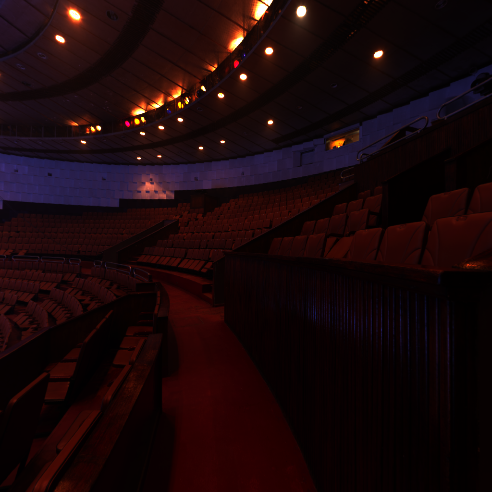

  <h1>Salamander</h1>
  
Ivans Minajevs

  

  <a href="https://github.com/Howest-DAE-GD/graphics-programming-2-vulkan-project-introsent">https://github.com/Howest-DAE-GD/graphics-programming-2-vulkan-project-introsent</a> 
  

    Salamander is a 3D rendering engine built with Vulkan using C++ 20.
    The software in question functions as a standalone graphics engine, with the purpose of demonstrating the capabilities of the Vulkan framework.
    The emphasis is placed on the maintenance of the system and the adherence to the established design practices.
  

  <h2>Overview</h2>
  <ul>
    <li><strong>Deferred rendering</strong></li>
    <li><strong>HDR with later tone mapping</strong></li>
    <li><strong>Directional and omni lights</strong></li>
    <li><strong>IBL using environmental cube maps and diffuse irradiance</strong></li>
    <li><strong>Skybox</strong></li>
    <li><strong>Shadow mapping for directional light</strong></li>
    <li><strong>Double buffering</strong></li>
  </ul>

  <h2>Modern Rendering Workflow</h2>
  <h3>Initialization</h3>
  <h4>Environment cube map</h4>
  <table>
    <tr>
      <td></td>
      <td></td>
      <td></td>
    </tr>
    <tr>
      <td></td>
      <td></td>
      <td></td>
    </tr>
  </table>
  <h4>Diffuse irradiance cube map</h4>
  <table>
    <tr>
      <td></td>
      <td></td>
      <td></td>
    </tr>
    <tr>
      <td></td>
      <td></td>
      <td></td>
    </tr>
  </table>
  <h4>Shadow map (directional light view-projection)</h4>
  
  <h3>Depth prepass</h3>
  
  <h3>Geometry pass</h3>
  <h4>Albedo map</h4>
  
  <h4>Normal map</h4>
  
  <h4>Roughness map</h4>
  
  <h3>Lighting pass (HDR)</h3>
  
  <h3>Post-processing (tone mapping + exposure)</h3>
  

  <h2>Scene references</h2>
  <ul>
    <li><strong>Sponza</strong>: <a href="https://github.com/KhronosGroup/glTF-Sample-Assets/tree/main/Models/Sponza">https://github.com/KhronosGroup/glTF-Sample-Assets/tree/main/Models/Sponza</a> </li>
    <li><strong>Circus arena</strong>: <a href="https://polyhaven.com/a/circus_arena">https://polyhaven.com/a/circus_arena</a> </li>
    <li><strong>Bambanani Sunset</strong>:  <a href="https://polyhaven.com/a/bambanani_sunset">https://polyhaven.com/a/bambanani_sunset</a></li>
  </ul>

  <h2>Modern Vulkan Features</h2>
  <ul>
    <li><strong>Synchronization 2</strong></li>
    <li><strong>Dynamic rendering</strong></li>
    <li><strong>Vertex pulling using GPU address</strong></li>
    <li><strong>Deferred rendering</strong></li>
    <li><strong>Alpha cutout</strong></li>
  </ul>

  <h2>Sources</h2>
  <ul>
    <li><a href="https://vulkan.lunarg.com/">Vulkan SDK</a> (runtime, headers, validation layers)</li>
    <li><a href="https://www.glfw.org/">GLFW</a> (window/context management)</li>
    <li><a href="https://github.com/g-truc/glm">GLM</a> (mathematics library)</li>
    <li><a href="https://github.com/GPUOpen-LibrariesAndSDKs/VulkanMemoryAllocator">Vulkan Memory Allocator (VMA)</a></li>
    <li><a href="https://github.com/nothings/stb">stb_image</a> (image loading)</li>
    <li><a href="https://github.com/syoyo/tinygltf">tinygltfloader</a> (glTF loading)</li>
  </ul>

  

  

    For future development, Salamander aims to evolve into a 3D game engine. 
    Features on a list to be included: point lights shadows, automatic camera exposure, specular irradiance.
  

